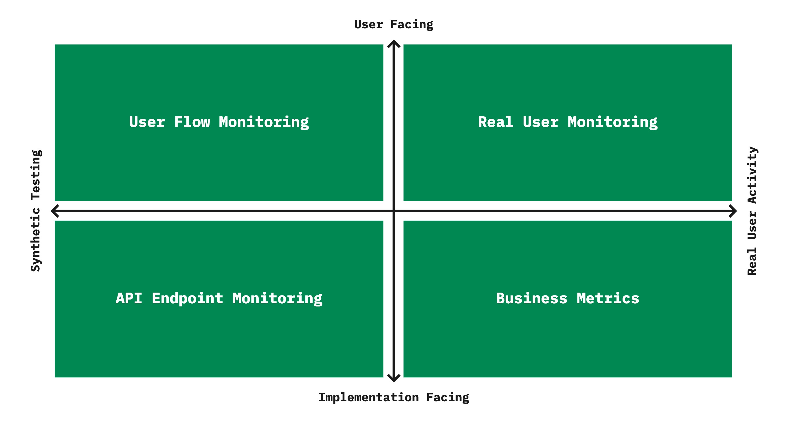

## Why Functional Monitoring?
Monitoring is as a crucial part of any successful Continuous Delivery implementation. Yet, we see that monitoring often 
is primarily focussed on technical metrics like instance health and error rate. 

These metrics are useful but
don't tell the story from the end-user perspective. For instance, all services could be "green", while our customers experience broken functionality. 

Functional Monitoring helps to bridge the gap between technical metrics and real user impact, greatly enhancing overall observability of the system.

## But which kinds of Functional Monitoring?
There are several kinds of Functional Monitoring we can apply but searching on the web you can easily get lost on what to do and how different kind of monitoring relates. How can we get a complete picture?

### Functional Monitoring Quadrants
We categorized 4 complementary types of Monitoring into what we call the _Functional Monitoring Quadrants_ which can help
to build a effective strategy for validating the correctness of the our software running in production

On the horizontal axis we differentiate activity that is coming from actual usage 
versus simulated activity, also know as _synthetic testing_ or _testing in production_.

On the vertical axis we differentiate activity which is direct user-facing 
versus activity which is  _implementation facing_. These tells us something about functional correctness but is more technil, and the relation to the user is _indirect_.

In each Quadrant we defined the single kind of test which we think is most suitable. 
It might be possible to come up with other tests too.

All of these different perspecitves matter and give us specific insights, while they also have their
own limitations. Together they for a complete picture. Let's look at the examples to learn more.

## Functional Monitoring in real life
### Case study: A checkout flow

_Consider this example case_. We will implement Functional Monitoring in a checkout-flow. 
It consists of 3 steps:
- Customer Details
- Shipping
- Payment

We have some integrations with internal and external services like an external service to provide payments options.
We want to be in control and not blindly trust on the external service

How could we approach this checkout flow? What kind of monitoring can we do in each quadrant?

## Functional Monitoring by Example
### Quadrant 1: User Flow Monitoring
#### Goal
I want to measure availability and performance of a critical business flow from the user’s perspective.
#### Example
I play a recorded checkout flow through the user's
perspective. I measure that the scenario works end-to-end and how long it takes to go through the complete flow
#### Limitation
Assumption based happy flow. Users might follow a different path with unexpected problems, these will not be found pro-actively.
Subject to continuous maintenance.

### Quadrant 2: Real User Monitoring
#### Goal
Measure actual usability and performance of the website from the customers perspective.
#### Example
I insert JavaScript (client-side code) to measure where
customers drop off, or experience slowness.
#### Limitations
Less data when there is less usage (e.g., at night). Performance measurements are impacted by the capabilities of devices and connectivity of the user.

### Quadrant 3: Business Metrics 
#### Goal
Use data from the different applications to get insights into the business goals to determine if there is an anomaly.
#### Example
I measure the orders over time to detect whether I get
less orders then expected.
#### Limitation
Anomaly Detection Less valuable when there is a low amount of traffic.

### Quadrant 4: API Endpoint Monitoring
#### Goal
Measure that the individual calls give the functionally correct responses, so incorrectness is detected fast.
#### Example
I check that the payment-options call gives me the correct
payment options.
#### Limitation
Small checks, you only measure the parts but not the sum of the parts.

## Best practices
• Identify the most critical flow(s)\
 
• Start with one flow and learn\
 
• Keep the number of tests to a minimum\
 
• Make it fail\
 
• Don’t make the assertions overly strict\
 
• Exclude from A/B testing and Analytics\

If you don't have a front-end you could do a sequence of API calls

## Conclusion
We've seen examples of a test in each Quadrant. It really depends on your situation the amount   you probably need them all to some extent
