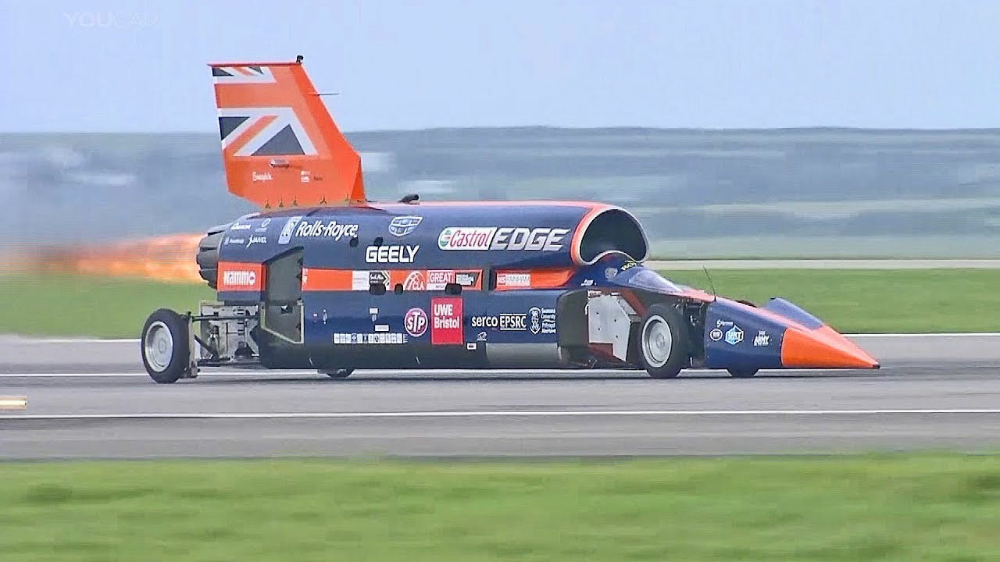

#### You perceive your time to market for new features to be slow and want to speed up
You experience that things are slow, and it's hard to finish anything within an iteration. 
You've tried to deliver smaller increments, but it is still a struggle to complete these in a reasonable amount of time. 
One of the reasons of the perceived slowness might be that wasteful activities and unnecessary handovers are hiding in your development process. 
#### A Value Stream Map (VSM) can help you uncover these kinds of waste in your software delivery process
Value Stream Mapping is a form of lean-management and was at the foundation of the Toyota Production System.
A VSM maps the series of activities that take a product or service from the beginning of a process (idea) until it reaches the customer. 
  
Even though the technique stems from the manufacturing world, it can be applied to software as well.
In software development in particular, it is a helpful technique because of the [high cost of context switching](https://xebia.com/blog/epic-focus-measure-your-way-to-a-better-time-to-market/) associated with wait times.
 
#### How to do it for a software project?
I recommend doing it in a workshop format where everyone who is involved in the delivery process participates to map the activities from inception until deployment into production.
The technique is simple but the devil is in the details.

Choose a few relevant and representative tickets that the team has recently completed to map all the activities involved in delivery. For example: Writing code, wait for code review, execute automated tests, etc.

Next, classify each activity as Customer Value Adding (CVA), Business Value Adding (BVA), Necessary Non-Value Adding(NNVA) and Waste.

In the above example the activities would be classified as following:
Writing code -> CVA,
Creating developer documentation -> BVA,
Running CI pipeline, execute automated tests -> NNVA,
Wait for code review -> Waste

It is now possible to calculate the cycle efficiency. The outcome will be a baseline for your teams from which you improve.
  
Note that the visual and collaboration aspects are important and performing these steps in a workshop will already lead to ideas for optimizations.
Next to that, it can also bring an increased level of empathy in the case of siloed organizations and you will help make the growth of a team more tangible. 

#### Can I do it just for the development team?
You can and it will still be very useful for optimizing the cycle time.
The advantage is that a team can do it without any dependencies on the rest of the organization.
It is smaller and is easier to organize.
Most value is achieved by mapping the complete value stream though. If involving everyone is hard you might just have discovered an organizational and/or cultural problem.
#### Could you share some examples of waste that were identified with the help of a VSM?
Yes, a client I helped recently had a double code review (one in the team and one outside). The huge amount of handovers 
and wait times had always been hidden but now became visible to the teams. Because of all the waiting, teams would switch to other tasks which effectively meant that everything was in progress at the same time. 

After a tough discussion, we convinced one of the teams to experiment with pair programming. Besides knowledge sharing this greatly reduced the amount of waste. It made them 33% faster(!) creating an upward spiral and motivation for the team. 
  
Another client had a Product Owner signoff step which on average took several days to start, adding waste to the process.
The development teams were very aware of the problem but the VSM exercise helped convince the 
Product Owner through data that this quality gate was incredibly expensive and would lead to context switching. 
It became clear that the PO needed to work more closely with the team throughout the iteration instead of validating features after implementation. 
You will be surprised by the insights what the data shows!
#### We are doing Scrum. I've been told a VSM does not apply for Scrum teams
In Scrum, the three pillars Transparency, Inspection and Adaptation should enable autonomous, T-shaped teams to 
self organize, optimize and eliminate waste. In reality, teams with various maturity levels struggle 
to do so. Often they are not aware of the wasteful nature of certain activities and the hidden cost of handovers so they
do not try to optimize for this.

It can be hard for Scrum masters and Agile Coaches effectively facilitate and challenge teams in this area. 
  
I do make some adjustments for Scrum: The only official roles in a Scrum team are Dev, PO, and SM.
I tend to focus on the activites and not work from roles.
Furthermore (mature) Scrum teams tend to be less rigid and more fluid in terms of the flow of work.
Still, certain steps do always take place and lead to a picture as below, usually mirroring the CI/CD pipeline with all the human activities required for each step.
#### Should I use specialized tooling?
Tooling exists and can make the automation of the calculations easier, as well as repeatability and 
storing results from specific measurement periods.
I find the results are better using sharpies and stickies on a physical board.
The visual aspect of it is important and through collaborating interactively important insights are shared and a common understanding is reached.
#### Downsides and when not to use a VSM
Consider not using the technique if you expect it might be used to measure the performance of a team and be used against them or when psychological safety is lacking.
When safety is missing or fragile it will impact the spirit and creativity of the session which will not work.
   
The results from the VSM are an indication and should not be treated as hard numbers.
Also, make sure that creating the VSM doesn't become waste by spending enormous amounts of time gathering the input data.
Estimates will usually do fine!  
#### Conclusions
VSM's can help you make inefficiencies in the development process visible.
In my opinion, a VSM is an essential element in the toolbox of any coach.
Furthermore, for teams, it tends to be inspiring and can help kickstart a culture of continuous improvement.
Last but not least, a VSM can make team progress and coaching results more tangible.
Try it!

